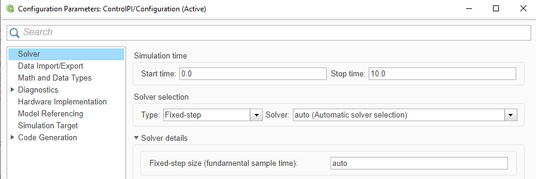
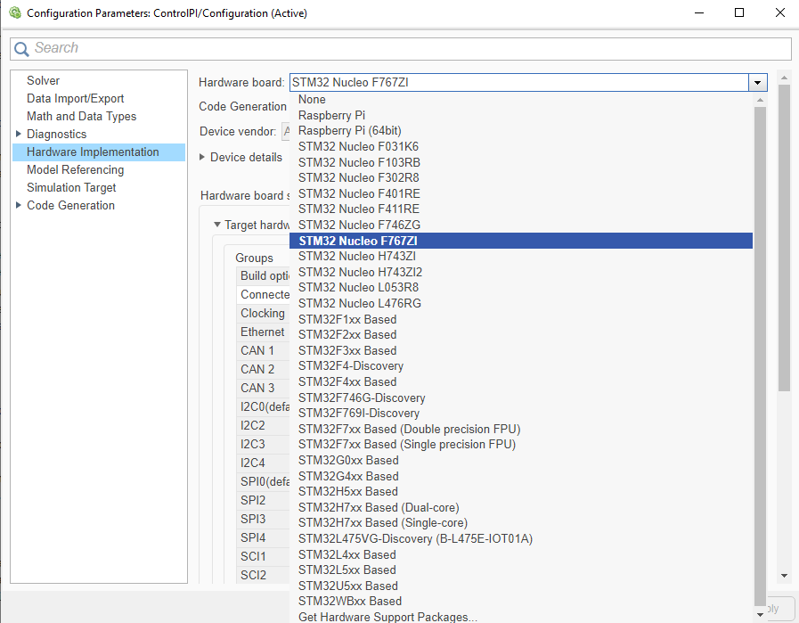
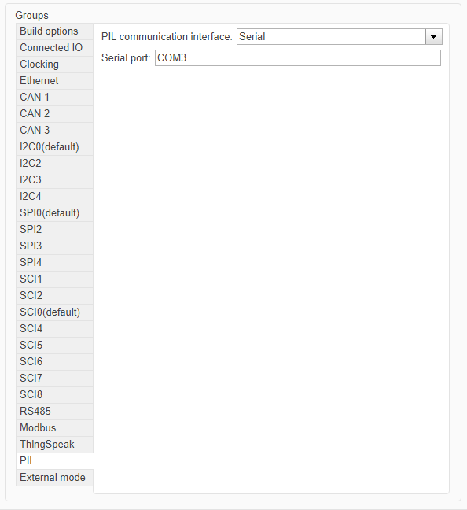
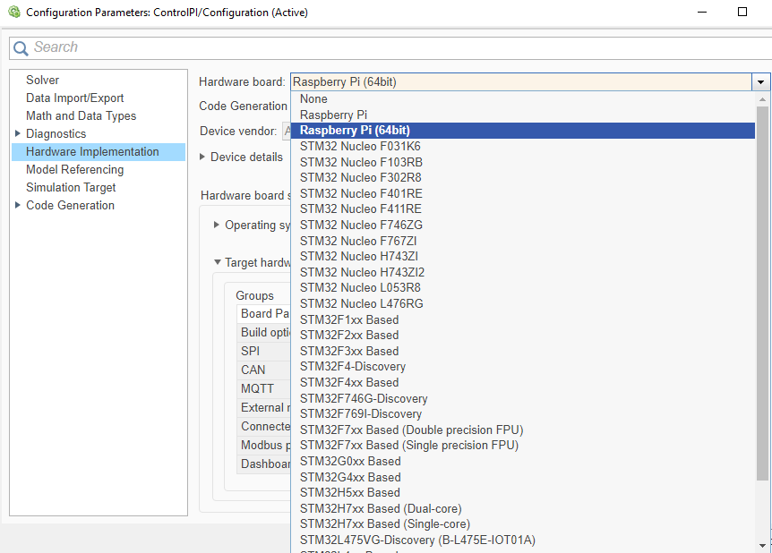
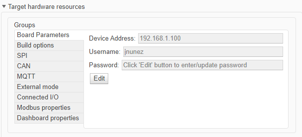
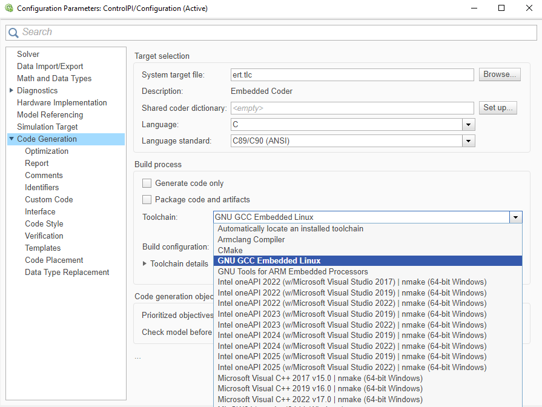

# Guía 1.2: Configuración de las plataformas para PIL
 
## Objetivo
 
Para esta etapa se configura el modelo de Simulink para ejecutar PIL en la **NUCLEO-F767ZI** y en la **Raspberry Pi 5**. La configuración se hace una sola vez por modelo e indica cómo se genera el código, para qué placa y como se comunica con el computador.
 
## Contexto
 
Con las herramientas de la Guía 1 instaladas, falta configurar a Simulink con qué placa trabajar y cómo conectarse a ella. Esa información se ingresa en el cuadro *Configuration Parameters* del modelo, que se abre con Ctrl+E.
 
Lo que cambia entre las plataformas es el canal de comunicación: la NUCLEO usa un puerto serial y la Raspberry Pi usa la red (TCP/IP). Para la STM32 hay dos configuraciones. Si la placa tiene soporte, todo se configura en Simulink sin abrir STM32CubeMX. Si no lo tiene, además hay que crear y configurar un proyecto de STM32CubeMX que el modelo importa ([Configure STM32 Boards using STM32CubeMX with Simulink](https://www.mathworks.com/help/releases/R2025b/ecoder/stmicroelectronicsstm32f4discovery/ug/STM32-CubeMX-Configuration.html)). Para la Raspberry Pi hay una sola configuración.
 

## Paso previo: solver del modelo
 
Para generar y verificar código, el modelo debe usar un solver de paso fijo, porque el código generado solo admite ese tipo de solver. Además, el controlador solo tiene estados discretos, por lo que el solver `discrete (no continuous states)` es el adecuado.
 
En *Configuration Parameters*, sección *Solver*, se configura:
 
| Parámetro       | Valor                             |
| --------------- | --------------------------------- |
| Type            | `Fixed-step`                      |
| Solver          | `discrete (no continuous states)` |

 
El valor por defecto de *Fixed-step size* es `auto`, que elige un paso que cubra todos los tiempos de muestreo del modelo ([Fixed-step size](https://www.mathworks.com/help/simulink/gui/fixedstepsizefundamentalsampletime.html))
 

 
## Configuración 1: STM32 con soporte
 
Es el caso de la NUCLEO-F767ZI: Simulink la reconoce por nombre, por lo que solo hay que elegir la placa e indicar cómo se comunica con el computador. Ambas cosas se hacen en *Configuration Parameters*, sección *Hardware Implementation*.
 
### Paso 1: Seleccionar la placa
 
Lo primero es indicar para qué placa se generará el código. Despliega **Hardware Implementation > Hardware board** y selecciona la entrada de la NUCLEO-F767ZI. Al elegirla, aparecen debajo los parámetros propios de la placa, entre ellos *Target hardware resources*, que se usa en el paso siguiente.
 

 
### Paso 2: Configurar la comunicación
 
En PIL, el modelo se comunica con la placa por un puerto serial: el computador ve la placa como un puerto COM y la placa usa un periférico llamado USART. El modelo necesita conocer ambos.
 
Conecta la placa con un cable Micro USB y anota su puerto COM en el Administrador de dispositivos, en *Puertos (COM y LPT)*. Luego, en *Hardware Implementation > Target hardware resources*, selecciona *External mode* y, en *Communication interface*, elige *Serial*. En *Connectivity*, selecciona el USART3 e indica el COM Port anotado. En la NUCLEO-F767ZI se usa el USART3 porque el ST-LINK expone un puerto COM virtual hacia el computador, conectado internamente a ese periférico en los pines PD8 y PD9 ([UM1974, manual de las placas Nucleo-144](https://www.st.com/resource/en/user_manual/dm00244518.pdf)).
 

 
## Configuración 2: STM32 sin soporte
 
Algunas placas no aparecen por nombre en la lista de Simulink, aunque su microcontrolador sí pertenezca a una serie soportada. Como Simulink no conoce la placa, el USART y sus pines deben configurarse a mano en un proyecto de STM32CubeMX, y el modelo importa ese proyecto. Aquí se parte con el solver del paso previo.
 
### Paso 1: Seleccionar la serie
 
En vez de una placa, se elige una opción genérica de la serie del microcontrolador. En **Hardware Implementation > Hardware board**, elige la opción custom de tu serie (en la serie F4xx, la documentación la llama *custom STM32F4xx Based hardware*).
 
*[Agregar imagen: lista Hardware board con la opción custom de la serie.]*
 
### Paso 2: Crear el proyecto de STM32CubeMX
 
STM32CubeMX es la herramienta donde se configuran los periféricos del microcontrolador, y el modelo la recibe como un proyecto con extensión `.ioc`. En este paso se crea ese proyecto y se abre.
 
En *Build options*, usa *Browse* si ya tienes un proyecto `.ioc`, o *Create* para crear uno nuevo: escribe el nombre con extensión `.ioc`, elige la carpeta, selecciona el microcontrolador de tu placa y confirma con *Apply* y *OK*. Luego presiona *Launch* para abrirlo en STM32CubeMX.
 
*[Agregar imagen: sección Build options con los botones Browse, Create y Launch.]*
 
### Paso 3: Configurar el reloj, los pines y el USART
 
Un proyecto creado solo desde el microcontrolador parte sin pines asignados. Antes de configurar el USART hay que resolver el reloj y los pines.
 
En *Clock Configuration*, ajusta el reloj del sistema. En *Pinout & Configuration*, asigna los pines TX y RX del USART elegido, haciendo clic sobre ellos en el diagrama del encapsulado; los pines conectados al ST-LINK están indicados en el esquemático de la placa. Después configura el USART con los valores de la Tabla 1 y guarda el proyecto ([Serial Configuration for Monitor & Tune and PIL](https://www.mathworks.com/help/releases/R2025b/ecoder/stmicroelectronicsstm32f4discovery/ug/External-mode-PIL.html)).
 
*Tabla 1: Configuración del USART en STM32CubeMX.*
 
| Parámetro | Valor |
| --- | --- |
| Mode | Asynchronous. |
| Baud Rate | El que usará el modelo; anótalo. |
| DMA Settings | Solicitud DMA para la recepción del USART. |
 
*[Agregar imagen: vista Pinout & Configuration con los pines TX y RX asignados.]*
 
### Paso 4: Configurar la comunicación en el modelo
 
Con el proyecto listo, falta indicarle al modelo el puerto del computador y el USART elegido. Conecta la placa con un cable Micro USB y anota su puerto COM en el Administrador de dispositivos, en *Puertos (COM y LPT)*.
 
En *Hardware Implementation > Target hardware resources*, selecciona *External mode* y, en *Communication interface*, elige *Serial*. En *Connectivity*, selecciona el USART configurado en el paso anterior e indica el COM Port. El baud rate debe coincidir con el del proyecto de STM32CubeMX.
 
*[Agregar imagen: pestaña Connectivity con los campos USART y COM Port.]*
 
## Configuración 3: Raspberry Pi 5
 
La Raspberry Pi 5 es un computador con Linux, por lo que no se configuran periféricos ni pines. Simulink se conecta a ella por red, usando la dirección y las credenciales de su Linux, y esos datos se ingresan en la configuración del modelo ([Model Configuration Simulink Support Package for Raspberry Pi Hardware](https://www.mathworks.com/help/releases/R2025b/simulink/supportpkg/raspberrypi_ref/raspberrypi-model-configuration-parameters.html)). La placa debe estar encendida y en la misma red que el computador. Aquí también se parte con el solver del paso previo.
 
### Paso 1: Seleccionar la placa
 
Igual que en la STM32, se indica para qué placa se genera el código. En **Hardware Implementation > Hardware board**, selecciona *Raspberry Pi*. Esto carga los parámetros por defecto de la placa, que se completan en el paso siguiente.
 

 
### Paso 2: Completar los parámetros de conexión
 
Con la placa seleccionada aparecen sus parámetros. Cuatro de ellos son los que Simulink usa para encontrar la Raspberry y acceder a su Linux; complétalos con los valores de la Tabla 2.
 
*Tabla 2: Parámetros de conexión con la Raspberry Pi.*
 
| Parámetro | Valor |
| --- | --- |
| Device Address | Dirección IP o nombre de host de la placa. |
| Username | Usuario de Linux de la placa. |
| Password | Contraseña de ese usuario. |
 
Para confirmar lo registrado, ejecuta `raspberrypi` en la Command Window: devuelve el nombre de host, el usuario, la contraseña y el directorio de compilación de la última conexión exitosa ([raspberrypi](https://www.mathworks.com/help/releases/R2025b/simulink/supportpkg/raspberrypi_ref/raspberrypi.html)).
 

 
### Paso 3: Revisar la toolchain
 
La toolchain es el compilador que Simulink usa para construir el código generado. Para la Raspberry debe estar seleccionada **GNU GCC Embedded Linux**, que es la que usa el ejemplo oficial de PIL con Raspberry Pi citado en el paso previo. La opción está en *Code Generation > Toolchain*.
 

 
## Validación
 
Si el modelo tiene el solver de paso fijo, la placa seleccionada y los parámetros de comunicación completos, la configuración está lista. Guarda el modelo.
