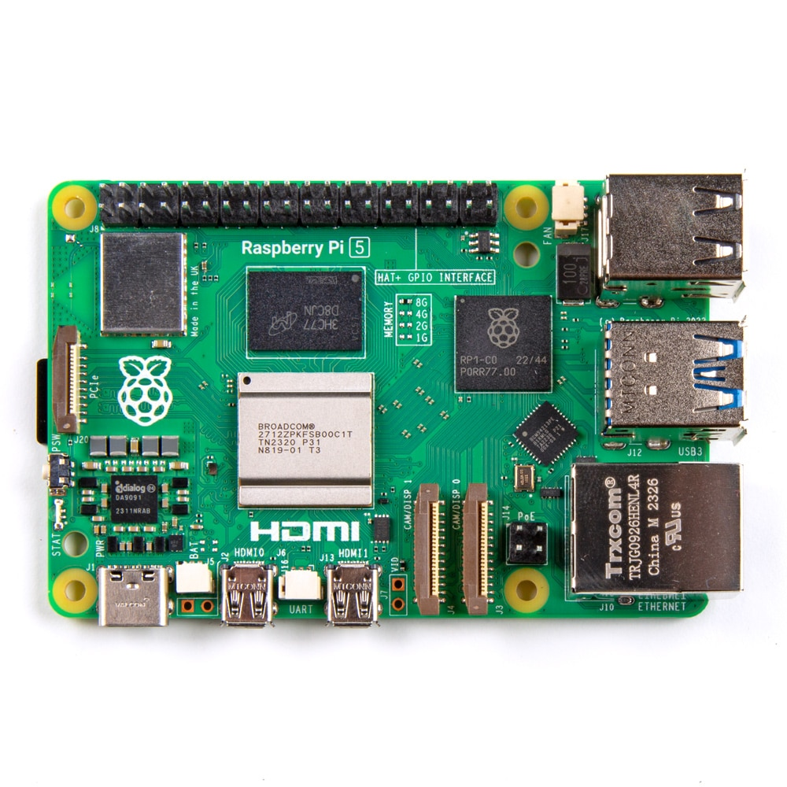
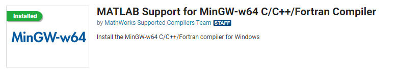
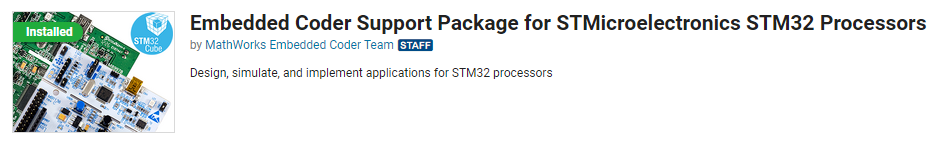
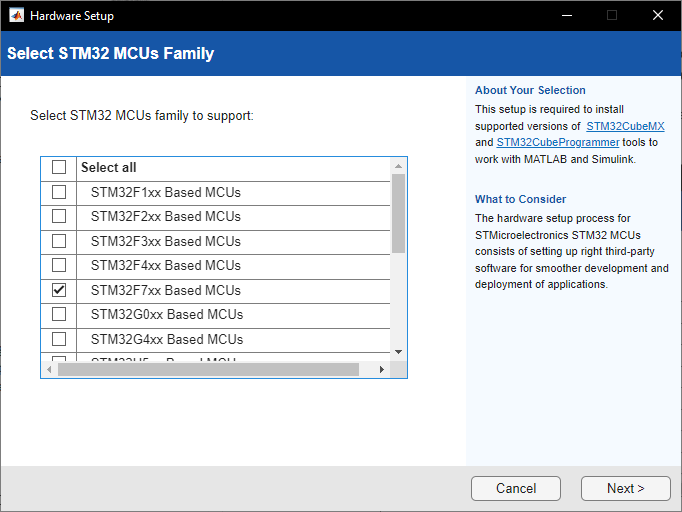
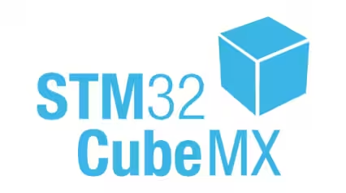
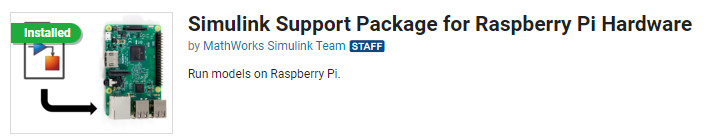

# Guía 1: Instalación del entorno
 
## Objetivo
 
Esta etapa deja instaladas las herramientas necesarias para usar la simulación PIL en las dos plataformas de este trabajo: la **STM32-NUCLEO-F767ZI** y la **Raspberry Pi 5**. Primero se instalan las herramientas comunes entre ambas, y luego lo específico de cada placa. Al finalizar esta guía se busca que el computador reconozca las dos placas y quede listo para las guías siguientes.
 
| | |
| :---: | :---: |
| |  |
| *Raspberry Pi 5* | *STM32 NUCLEO-F767ZI* |

*Figura 1: Plataformas utilizadas en este trabajo.*

## Contexto
 
Primero que nada, una simulación PIL necesita cinco elementos a descargar:

1. Los productos de MathWorks que generan el código C desde Simulink.
2. Un compilador de C en el computador.
3. Un paquete de soporte para la placa.
4. Una toolchain que compila ese código para el procesador de la placa.
5. Las herramientas propias de cada placa: STM32CubeMX en la STM32 y el sistema operativo en la Raspberry Pi.

Los dos primeros elementos tienen una instalación comun para cualquier placa; los tres últimos dependen de una instalación especifica ([Requerimientos de Embedded Coder](https://www.mathworks.com/support/requirements/embedded-coder.html)).

Las herramientas (1)-(3) se instalan desde el Add-On Explorer de MATLAB. Para revisar lo ya instalado, se verifica en **Home > Add-Ons > Manage Add-Ons**.
 
## Instalación común
 
### 1) Productos de MathWorks
A continuación se instalarán las herramientas proporcionadas por el propio MathWorks.
La Tabla 1 lista los productos necesarios para ambas plataformas.
 
*Tabla 1: Productos de MathWorks requeridos.*
 
| Producto        | Para qué sirve                                       |
| ---------------- | --------------------------------------------------  |
| MATLAB           | Entorno base.                                       |
| Simulink         | Entorno para simular y modelar.                     |
| MATLAB Coder     | Genera código C y C++ a partir de código MATLAB.    |
| Simulink Coder   | Genera el código C desde bloques en Simulink.       |
| Embedded Coder   | Genera código para sistemas embebidos y habilita simulaciones SIL/PIL.               |
| Control System Toolbox (opcional) | Modelar, analizar y sintonizar sistemas de control.|
 
### 2) Compilador de C
 
Embedded Coder también requiere un compilador de C en el computador. La lista de compiladores compatibles para Windows está en [Compiladores Soportados](https://www.mathworks.com/support/requirements/supported-compilers.html).
 
Por conveniencia, se utilizará el compilador MinGW para estas guías, debido a lo conocido y confiable que es ([Link MinGW de Matlab](https://la.mathworks.com/matlabcentral/fileexchange/52848-matlab-support-for-mingw-w64-c-c-fortran-compiler)).

 
## Instalación específica: STM32F767ZI
 
### 3) Paquete de soporte para STM32
 
El soporte para STM32 se instala como un complemento aparte, cuyo nombre depende de la versión de MATLAB:
 
- Hasta R2025b: Embedded Coder Support Package for STMicroelectronics STM32 Processors.
La familia STM32F7xx, a la que pertenece la NUCLEO-F767ZI, tiene soporte, por lo que su configuración es más fácil. (Si la versión de la NUCLEO no tiene soporte, se puede realizar la simulación PIL, pero antes hay que configurar los pines de comunicación en STM32CubeMX.) ([Link Embedded Coder](https://www.mathworks.com/matlabcentral/fileexchange/43093))
 

### 4) Toolchain para STM32

La toolchain de la STM32 es **GNU Tools for ARM Embedded Processors**. La instala el asistente *Hardware Setup* del paquete de soporte, que se abre desde el **Add-On Manager** (**Home > Add-Ons > Manage Add-Ons**) con el botón **Setup**.

Sigue los pasos del asistente hasta terminar. En la pantalla de instalación de herramientas de terceros, presiona **Install** y acepta los permisos de administrador si los pide.

 

### 5) Herramientas propias de la STM32

Las herramientas propias de esta placa son **STM32CubeMX**, que genera el código de inicialización de los periféricos, y **STM32CubeProgrammer** (opcional), que descarga el ejecutable a la placa. Ambas se configuran desde el asistente *Hardware Setup* del paquete de soporte, en la misma ventana donde se instala la toolchain. Sigue sus pasos hasta terminar.

  

STM32CubeMX es obligatorio para PIL, porque ahí se configura el puerto serial por el que el modelo se comunica con la placa.

 
## Instalación específica: Raspberry Pi 5
 
### 3) Paquetes de soporte para STM32
 
El soporte para STM32 se instala con dos complementos, cuyo nombre depende de la versión de MATLAB:
 
- Hasta R2025b: Embedded Coder Support Package for STMicroelectronics STM32 Processors.
La familia STM32F7xx, a la que pertenece la NUCLEO-F767ZI, tiene soporte, por lo que su configuración es más fácil. (Si la versión de la NUCLEO no tiene soporte, se puede realizar la simulación PIL, pero antes hay que configurar los pines de comunicación en STM32CubeMX.) ([Link Embedded Coder](https://www.mathworks.com/matlabcentral/fileexchange/43093))

- Hasta R2025b: Simulink Coder Support Package for STMicroelectronics Nucleo Boards.
Agrega soporte para las placas Nucleo, entre ellas la NUCLEO-F767ZI. ([Link Nucleo](https://www.mathworks.com/matlabcentral/fileexchange/58942-simulink-coder-support-package-for-stmicroelectronics-nucleo-boards))

 
### 4) Toolchain para Raspberry Pi 5
 
La toolchain que usa PIL con la Raspberry Pi es **GNU GCC Embedded Linux** ([SIL and PIL Verification for Reinforcement Learning](https://www.mathworks.com/help/reinforcement-learning/ug/sil-and-pil-verification-for-reinforcement-learning.html)). A diferencia de la STM32, no se instala en el computador: el asistente de hardware deja en la placa las herramientas necesarias, y en el modelo solo se comprueba que esté seleccionada. 
 
### 5) Herramientas propias de la Raspberry Pi 5
 
La herramienta propia de esta placa es su **sistema operativo**, que debe estar escrito en la tarjeta SD con Raspberry Pi Imager ([Instalador Pi Imager](https://www.raspberrypi.com/software/)).
 
Este es el único elemento que se instala antes que el paquete de soporte, porque el asistente de hardware necesita conectarse a una placa que ya esté funcionando.
 
 
## Validación
 
Si ambos asistentes terminaron sin errores, el entorno está listo. La siguiente guia ayuda con el tema de configurar cada placa para la simulación de PIL.