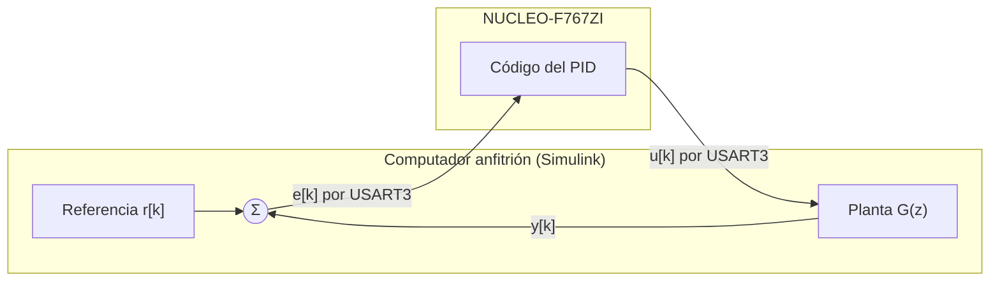

# Guía 2: Controlador PID con PIL en STM32F767ZI

## Objetivo

En esta guía el lector implementa un controlador PID discreto y lo ejecuta en la NUCLEO-F767ZI mediante PIL. Luego verifica que el código generado reproduce el modelo. Al final, el lector cambia las ganancias del controlador sin recompilar el código.

## Contexto

La guía utiliza PIL mediante el bloque Model de Simulink. En modo PIL, el bloque Model genera código del modelo referenciado, lo compila para la plataforma objetivo y lo ejecuta en ella ([Model block](https://www.mathworks.com/help/simulink/slref/model.html)). Durante la simulación, el anfitrión y la placa intercambian datos en cada paso de tiempo ([Model block, R2021a](https://www.mathworks.com/help//releases/R2021a/simulink/slref/model.html)).

El controlador queda en un modelo referenciado, que se ejecuta en la placa. La planta queda en el modelo de prueba, que se ejecuta en Simulink. La Figura 1 muestra esa partición y las señales que cruzan el canal serial en cada paso $k$.



*Figura 1: Partición del lazo de control en una simulación PIL con bloque Model.*

El modelo de prueba contiene dos bloques Model que apuntan al mismo controlador, uno en modo PIL y otro en modo Normal. El ejemplo oficial de MathWorks para STM32 usa esa misma estructura ([Code Verification and Validation with PIL for STM32](https://www.mathworks.com/help/stm32b/ug/STM32F4xx-PIL-example.html)). La comparación entre ambos lazos muestra si el código ejecutado en la placa reproduce el modelo.

## Caso de estudio

La planta es un sistema de primer orden con ganancia unitaria y constante de tiempo $\tau = 10\ \text{ms}$, que aproxima un motor DC. El periodo de muestreo es $T_s = 1\ \text{ms}$. La discretización con retenedor de orden cero (ZOH) entrega la planta discreta de la Ecuación 1.

$$
G(z) = \frac{0.0952}{z - 0.9048} \tag{1}
$$

La función `c2d` de Control System Toolbox calcula la Ecuación 1 con el método ZOH, que asume entradas constantes durante cada periodo de muestreo ([c2d](https://www.mathworks.com/help/control/ref/dynamicsystem.c2d.html)):

```matlab
G = c2d(tf(1, [0.01 1]), 0.001, 'zoh')
```

El controlador usa el bloque Discrete PID Controller en forma paralela. Sus ganancias son $K_p = 0.5$ (proporcional), $K_i = 10$ (integral) y $K_d = 0$ (derivativa). Con $K_d = 0$ el controlador actúa como un PI. La guía mantiene la estructura PID para que el lector pueda agregar acción derivativa sin modificar el modelo.

## Paso 1: Definir los parámetros del controlador

Las ganancias del controlador se definen como variables del workspace y no como números escritos en el bloque. En Model block PIL, Simulink permite ajustar parámetros del workspace, pero no parámetros escritos en el cuadro de diálogo del bloque ([SIL and PIL Limitations](https://www.mathworks.com/help/ecoder/ug/sil-and-pil-simulation-limitations.html)).

Cada ganancia se crea como un objeto `Simulink.Parameter` con la clase de almacenamiento `ExportedGlobal`. Esa clase hace que el parámetro aparezca en el código generado como una variable global ajustable ([Create Tunable Calibration Parameter](https://www.mathworks.com/help/rtw/ug/use-parameter-objects-for-code-generation.html)).

Cree el script `parametros_pid.m` con el siguiente contenido y ejecútelo antes de abrir los modelos:

```matlab
Ts = 0.001;                                   % Periodo de muestreo [s]

Kp = Simulink.Parameter(0.5);                 % Ganancia proporcional
Kp.CoderInfo.StorageClass = 'ExportedGlobal';

Ki = Simulink.Parameter(10);                  % Ganancia integral
Ki.CoderInfo.StorageClass = 'ExportedGlobal';

Kd = Simulink.Parameter(0);                   % Ganancia derivativa
Kd.CoderInfo.StorageClass = 'ExportedGlobal';
```

El periodo de muestreo `Ts` queda como un número simple, porque el tiempo de muestreo no es un parámetro ajustable entre simulaciones ([Get Started with Fast Restart](https://www.mathworks.com/help/simulink/ug/fast-restart-workflow.html)).

## Paso 2: Crear el modelo del controlador

Cree un modelo nuevo llamado `pid_ctrl.slx` con tres bloques conectados en serie. El **Inport** recibe el error $e[k]$, el **Discrete PID Controller** calcula la acción de control y el **Outport** entrega $u[k]$. La Figura 2 muestra el modelo resultante.

Configure el bloque Discrete PID Controller con los valores de la Tabla 1 ([Discrete PID Controller](https://www.mathworks.com/help/simulink/slref/discretepidcontroller.html)).

*Tabla 1: Parámetros del bloque Discrete PID Controller.*

| Parámetro         | Valor           |
| ----------------- | --------------- |
| Controller        | `PID`           |
| Form              | `Parallel`      |
| Time domain       | `Discrete-time` |
| Sample time       | `Ts`            |
| Integrator method | `Forward Euler` |
| Proportional (P)  | `Kp`            |
| Integral (I)      | `Ki`            |
| Derivative (D)    | `Kd`            |

La documentación del bloque recomienda Forward Euler cuando el periodo de muestreo es pequeño respecto del ancho de banda del controlador ([Discrete PID Controller](https://www.mathworks.com/help/simulink/slref/discretepidcontroller.html)). En el caso de estudio, $T_s$ es diez veces menor que la constante de tiempo $\tau$ de la planta.

!!! warning "Bloques que no deben ir en este modelo"
    El modelo `pid_ctrl` no debe contener bloques Scope ni To Workspace. SIL y PIL no admiten bloques Scope, y Model block PIL no admite bloques To Workspace ni tiempos de muestreo continuos ([SIL and PIL Limitations](https://www.mathworks.com/help/ecoder/ug/sil-and-pil-simulation-limitations.html)).

!!! info "Figura 2 (pendiente)"
    Captura del modelo `pid_ctrl.slx` con Inport, Discrete PID Controller y Outport.

## Paso 3: Configurar el modelo del controlador

Abra **Model Configuration Parameters** con **Ctrl+E** y ajuste las opciones de la Tabla 2.

*Tabla 2: Configuración del modelo `pid_ctrl`.*

| Panel                   | Parámetro          | Valor                             |
| ----------------------- | ------------------ | --------------------------------- |
| Solver                  | Type               | `Fixed-step`                      |
| Solver                  | Solver             | `discrete (no continuous states)` |
| Solver                  | Fixed-step size    | `0.001`                           |
| Hardware Implementation | Hardware board     | [VERIFICAR: nombre de la NUCLEO-F767ZI en la lista] |
| Code Generation         | System target file | `ert.tlc`                         |

La generación de código requiere un solver de paso fijo ([Type](https://www.mathworks.com/help/simulink/gui/type.html)). PIL además requiere que **Hardware Implementation** describa correctamente la placa, incluido el orden de bytes; si no, la simulación falla ([SIL and PIL Limitations](https://www.mathworks.com/help/ecoder/ug/sil-and-pil-simulation-limitations.html)). El archivo `ert.tlc` corresponde a Embedded Coder, y SIL/PIL admite solo archivos ERT, GRT o AUTOSAR ([Configure and Run SIL Simulation](https://www.mathworks.com/help/ecoder/ug/configuring-a-sil-or-pil-simulation.html)).

Luego configure la comunicación. En **Hardware Implementation > Target hardware resources > Connectivity**, seleccione el **COM Port** anotado en la Guía 1 y el **USART** `USART3` ([Code Verification and Validation with PIL for STM32](https://www.mathworks.com/help/stm32b/ug/STM32F4xx-PIL-example.html)).

!!! info "Figura 3 (pendiente)"
    Captura del panel Connectivity con el COM Port y USART3.

## Paso 4: Configurar el USART3 en STM32CubeMX

El USART3 del microcontrolador usa los pines PD8 (TX) y PD9 (RX), que la placa conecta al ST-LINK como puerto COM virtual ([Zephyr: Nucleo F767ZI](https://docs.zephyrproject.org/latest/boards/st/nucleo_f767zi/doc/index.html)). Por ese motivo, la comunicación PIL usa el USART3 y no requiere cables adicionales.

Primero cree el proyecto de STM32CubeMX desde el modelo ([Configure STM32CubeMX with Simulink](https://www.mathworks.com/help/stm32b/ug/stm32-cubemx-configuration.html)):

1. En **Hardware Implementation > Build options**, presione **Create**.
2. Asigne un nombre con extensión `.ioc`, seleccione la carpeta y presione **Apply** y **OK**.
3. Presione **Launch** para abrir el proyecto en STM32CubeMX.

Luego configure el USART3 en STM32CubeMX y guarde el proyecto ([Serial Configuration for PIL](https://www.mathworks.com/help/stm32b/ug/External-mode-PIL.html)):

1. Configure **Mode** en `Asynchronous`.
2. Especifique la **Baud Rate** [COMPLETAR: valor usado].
3. En **DMA Settings**, agregue una solicitud DMA para la recepción (RX).
4. Verifique que los pines asignados sean PD8 y PD9.

PIL funciona solo si esta configuración queda en el proyecto `.ioc` y el modelo importa ese archivo ([Serial Configuration for PIL](https://www.mathworks.com/help/stm32b/ug/External-mode-PIL.html)).

!!! info "Figura 4 (pendiente)"
    Capturas de STM32CubeMX con USART3 en modo Asynchronous y la solicitud DMA de recepción.

## Paso 5: Crear el modelo de prueba

Cree el modelo `banco_pid.slx` y aplique la misma configuración de los Pasos 3 y 4. El ejemplo oficial también configura el modelo de prueba para la placa STM32 ([Code Verification and Validation with PIL for STM32](https://www.mathworks.com/help/stm32b/ug/STM32F4xx-PIL-example.html)).

Construya dos lazos cerrados idénticos, como muestra la Figura 5. Cada lazo contiene:

1. Un bloque **Sum** con signos `+-` que calcula el error $e[k] = r[k] - y[k]$.
2. Un bloque **Model** que apunta a `pid_ctrl`.
3. Un bloque **Discrete Transfer Fcn** con numerador `[0.0952]`, denominador `[1 -0.9048]` y tiempo de muestreo `Ts`.

Ambos lazos comparten un bloque **Step** como referencia $r[k]$. Agregue un bloque **Subtract** que reste las salidas de ambas plantas y conecte las tres señales a un **Scope**.

!!! info "Figura 5 (pendiente)"
    Captura de `banco_pid.slx` con los dos lazos, el Step compartido y el Scope.

## Paso 6: Ejecutar la simulación PIL

Configure el bloque Model del primer lazo en modo PIL ([Configure and Run PIL Simulation](https://www.mathworks.com/help/ecoder/ug/configure-and-run-pil-simulation.html)):

1. Haga clic derecho sobre el bloque y seleccione **Block Parameters**.
2. En **Simulation mode**, seleccione `Processor-in-the-loop (PIL)`.
3. En **Code interface**, seleccione `Model reference`.
4. Presione **OK**.

El bloque muestra la etiqueta (PIL) en su ícono ([Model block](https://www.mathworks.com/help/simulink/slref/model.html)). Deje el bloque Model del segundo lazo en modo `Normal`.

Conecte la placa y presione **Run**. Simulink genera el código del controlador, lo compila, lo descarga a la placa y abre la comunicación por USART3 ([Test Generated Code with SIL and PIL Simulations](https://mathworks.com/help/ecoder/examples/software-and-processor-in-the-loop-sil-and-pil-simulation.html)).

!!! warning "Firewall de Windows"
    El firewall de Windows puede bloquear una simulación PIL. Si aparece una alerta de seguridad, permita el acceso ([Configure and Run SIL Simulation](https://la.mathworks.com/help/ecoder/ug/configuring-a-sil-or-pil-simulation.html)).

Durante la simulación no cierre el modelo. Para interrumpirla, presione **Ctrl+C** en la ventana de comandos ([Configure and Run SIL Simulation](https://www.mathworks.com/help/ecoder/ug/configuring-a-sil-or-pil-simulation.html)).

## Paso 7: Verificar la equivalencia numérica

El Scope muestra la salida del lazo PIL, la salida del lazo Normal y la diferencia entre ambas. Si el código generado reproduce el modelo, la diferencia es cero durante toda la simulación. En las pruebas de este trabajo, la diferencia máxima entre ambos lazos fue cero.

Para una comparación cuantitativa, registre ambas salidas y ábralas en el Simulation Data Inspector. El flujo automático de verificación de MathWorks usa esa misma herramienta para comparar simulaciones normales y PIL ([SIL/PIL Manager Verification Workflow](https://www.mathworks.com/help/ecoder/ug/verification-workflow-with-silpil-manager.html)).

!!! info "Figura 6 (pendiente)"
    Captura del Scope con ambas respuestas al escalón y la diferencia nula.

## Paso 8: Cambiar las ganancias sin recompilar

Con **Code interface** en `Model reference`, Simulink permite cambiar parámetros del workspace entre simulaciones, incluso con Fast Restart activo. En cambio, no permite cambiarlos mientras la simulación corre ([SIL and PIL Limitations](https://www.mathworks.com/help/ecoder/ug/sil-and-pil-simulation-limitations.html)).

Sin Fast Restart, cambiar el valor de un `Simulink.Parameter` obliga a regenerar el código C ([SIL and PIL Limitations](https://www.mathworks.com/help/ecoder/ug/sil-and-pil-simulation-limitations.html)). Con Fast Restart activo, después de la primera simulación el lector ajusta parámetros y repite la simulación sin recompilar ([Configure and Run PIL Simulation](https://www.mathworks.com/help/ecoder/ug/configure-and-run-pil-simulation.html)).

Para cambiar una ganancia:

1. Active **Fast Restart** en la barra de herramientas de Simulink ([Get Started with Fast Restart](https://www.mathworks.com/help/simulink/ug/fast-restart-workflow.html)).
2. Ejecute la simulación. La primera ejecución compila el código y lo descarga a la placa.
3. En la ventana de comandos, cambie el valor de la ganancia, por ejemplo `Kp.Value = 1.0;`.
4. Ejecute de nuevo la simulación. Simulink aplica el nuevo valor sin compilar el modelo ([Get Started with Fast Restart](https://www.mathworks.com/help/simulink/ug/fast-restart-workflow.html)).
5. Compare ambas respuestas en el Simulation Data Inspector.

Con Fast Restart activo, el lector no puede cambiar el periodo de muestreo, modificar la estructura del modelo ni guardar cambios. Para cualquiera de esas acciones, desactive Fast Restart ([Get Started with Fast Restart](https://www.mathworks.com/help/simulink/ug/fast-restart-workflow.html); [How Fast Restart Improves Iterative Simulations](https://uk.mathworks.com/help/simulink/ug/how-fast-restart-improves-iterative-simulations.html)).

!!! note "Cambio de parámetros durante la simulación"
    Si **Code interface** se configura en `Top model`, Simulink permite cambiar parámetros mientras la simulación corre. Con esa opción, un cambio entre simulaciones genera código nuevo para la siguiente ejecución ([SIL and PIL Limitations](https://www.mathworks.com/help/ecoder/ug/sil-and-pil-simulation-limitations.html)).

!!! info "Figura 7 (pendiente)"
    Captura del Simulation Data Inspector con las respuestas para $K_p = 0.5$ y $K_p = 1.0$.

Al completar esta guía, el lector cuenta con un controlador PID verificado en la NUCLEO-F767ZI mediante PIL, con ganancias ajustables sin recompilar. La guía siguiente replicará el mismo procedimiento sobre una Raspberry Pi 5.
