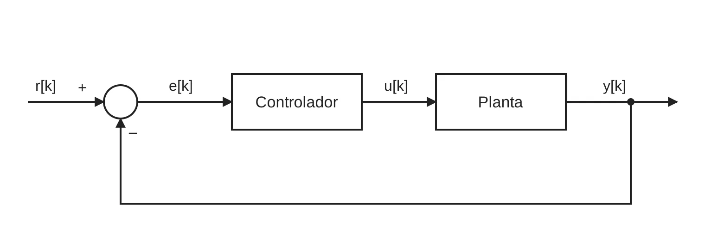
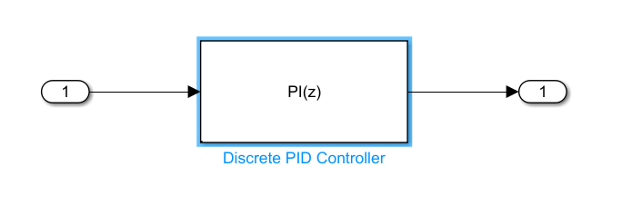
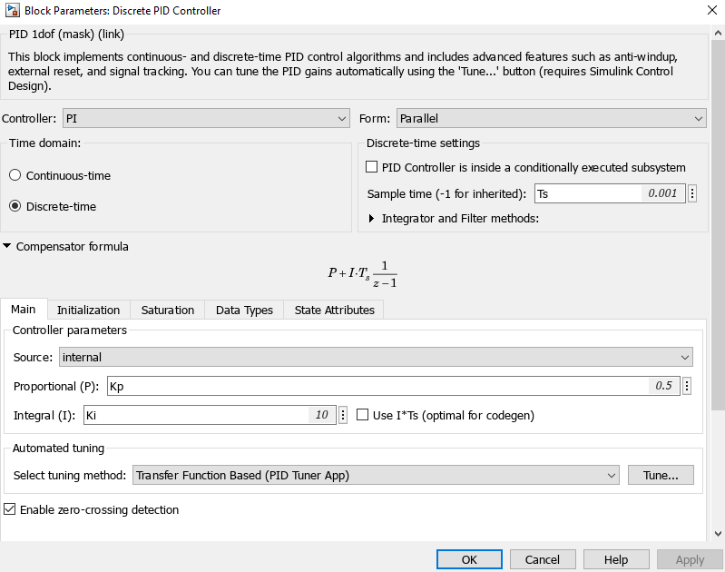
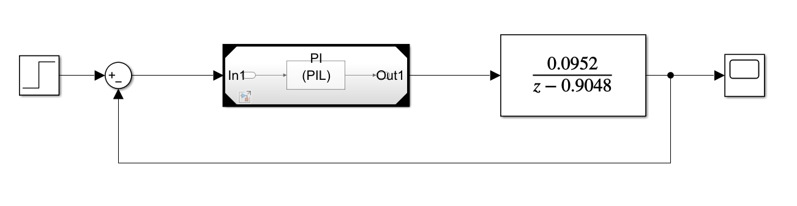
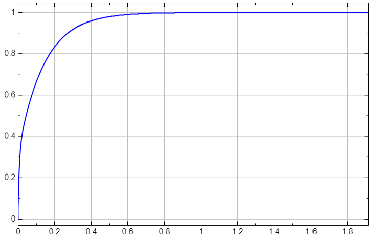
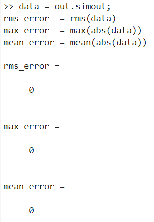

Guia 2 · MD
# Guía 2: Controlador PID con PIL en STM32F767ZI
 
## Objetivo
 
En esta guía el lector implementa un controlador PID discreto y lo ejecuta en la NUCLEO-F767ZI mediante PIL. Luego se necesita verificar que el código generado reproduce el modelo. Al final, se busca cambiar las ganancias del controlador sin recompilar el código.
 
## Contexto
 
La guía utiliza PIL mediante el bloque Model de Simulink. En modo PIL, el bloque Model genera código del modelo referenciado, lo compila para la plataforma objetivo y lo ejecuta en ella ([Model block](https://www.mathworks.com/help/simulink/slref/model.html)). Durante la simulación, el anfitrión y la placa intercambian datos en cada paso de tiempo.
 
La guía usa dos modelos de Simulink (archivos `.slx`). El modelo del controlador, `pid_ctrl.slx`, se ejecuta en la placa. El modelo de prueba, `banco_pid.slx`, contiene la planta y se ejecuta en Simulink. 
 

 
*Figura 1: Partición del lazo de control en una simulación PIL con bloque Model.*
 
El modelo de prueba contiene dos bloques Model que apuntan al mismo controlador, uno en modo PIL y otro en modo Normal. El ejemplo oficial de MathWorks para STM32 usa esa misma estructura ([Code Verification and Validation with PIL for STM32](https://www.mathworks.com/help/stm32b/ug/STM32F4xx-PIL-example.html)). La comparación entre ambos lazos muestra si el código ejecutado en la placa reproduce el modelo.
 
## Caso de estudio
 
La planta es un sistema de primer orden con ganancia unitaria y constante de tiempo $\tau = 10\ \text{ms}$, que aproxima un motor DC. El periodo de muestreo es $T_s = 1\ \text{ms}$. La planta se implementa directamente en tiempo discreto, con la función de transferencia de la Ecuación 1.

$$
G(z) = \frac{0.0952}{z - 0.9048} \tag{1}
$$

Los coeficientes de la Ecuación 1 equivalen a discretizar la planta continua $G(s) = 1/(\tau s + 1)$ con retenedor de orden cero (ZOH). El polo es $e^{-T_s/\tau} = 0.9048$ y el numerador es $1 - e^{-T_s/\tau} = 0.0952$. En Simulink, la planta se implementa con un bloque Discrete Transfer Fcn que usa esos coeficientes (Paso 5).
 
## Paso 1: Definir los parámetros del controlador
 
Las ganancias del controlador se definen como variables del workspace y no como números escritos en el bloque. En Model block PIL, Simulink permite ajustar parámetros del workspace.
 
Cada ganancia se crea como un objeto `Simulink.Parameter` con la clase de almacenamiento `ExportedGlobal`. Esa clase hace que el parámetro aparezca en el código generado como una variable global ajustable.
 
Cree el script `parametros_pid.m` con el siguiente contenido y ejecútelo antes de abrir los modelos:
 
```matlab
Ts = 0.001;                                   % Periodo de muestreo[s]
 
Kp = Simulink.Parameter(0.5);                 % Ganancia proporcional
Kp.CoderInfo.StorageClass = 'ExportedGlobal';
 
Ki = Simulink.Parameter(10);                  % Ganancia integral
Ki.CoderInfo.StorageClass = 'ExportedGlobal';
 
Kd = Simulink.Parameter(0);                   % Ganancia derivativa
Kd.CoderInfo.StorageClass = 'ExportedGlobal';
```
 
El periodo de muestreo `Ts` queda como un número simple, porque el tiempo de muestreo no es un parámetro ajustable entre simulaciones ([Get Started with Fast Restart](https://www.mathworks.com/help/simulink/ug/fast-restart-workflow.html)).
 
## Paso 2: Crear el modelo del controlador
 
Cree un modelo nuevo llamado `pid_ctrl.slx` con tres bloques conectados en serie. El bloque Inport recibe el error $e[k]$, el bloque Discrete PID Controller calcula la acción de control y el bloque Outport entrega $u[k]$. La Figura 2 muestra el modelo resultante.
 
Configure el bloque Discrete PID Controller con los valores de la Tabla 1 ([Discrete PID Controller](https://www.mathworks.com/help/simulink/slref/discretepidcontroller.html)).
 




*Tabla 1: Parámetros del bloque Discrete PID Controller.*
 
| Parámetro         | Valor           |
| ----------------- | --------------- |
| Controller        | `PID`           |
| Form              | `Parallel`      |
| Time domain       | `Discrete-time` |
| Sample time       | `Ts`            |
| Integrator method | `Forward Euler` |
| Proportional (P)  | `Kp`            |
| Integral (I)      | `Ki`            |
| Derivative (D)    | `Kd`            |
 
La documentación del bloque recomienda Forward Euler cuando el periodo de muestreo es pequeño respecto del ancho de banda del controlador. En el caso de estudio, $T_s$ es diez veces menor que la constante de tiempo $\tau$ de la planta.
 
## Paso 3: Configurar el modelo del controlador
 
Abra Model Configuration Parameters con Ctrl+E y ajuste las opciones de la Tabla 2.
 
*Tabla 2: Configuración del modelo `pid_ctrl`.*
 
| Panel                   | Parámetro          | Valor                             |
| ----------------------- | ------------------ | --------------------------------- |
| Solver                  | Type               | `Fixed-step`                      |
| Solver                  | Solver             | `discrete (no continuous states)` |
| Solver                  | Fixed-step size    | `auto`                            |
| Hardware Implementation | Hardware board     | [VERIFICAR: nombre de la NUCLEO-F767ZI en la lista] |
| Code Generation         | System target file | `ert.tlc`                         |
 
Para generar y verificar código, el modelo debe usar un solver de paso fijo, porque el código generado solo admite ese tipo de solver ([Choose a Solver](https://mathworks.com/help/simulink/ug/types-of-solvers.html)). Además, el controlador solo tiene estados discretos, por lo que el solver `discrete (no continuous states)` es el adecuado ([Solver](https://www.mathworks.com/help//releases/R2021a/simulink/gui/solver.html)).
 
El parámetro Fixed-step size se deja en `auto`, su valor por defecto. Con `auto`, Simulink elige un paso que cubra todos los tiempos de muestreo del modelo ([Fixed-step size](https://www.mathworks.com/help/simulink/gui/fixedstepsizefundamentalsampletime.html)). Como el único tiempo de muestreo del modelo es `Ts`, el paso resultante es `Ts`. Una vez compilado el modelo, el paso elegido se puede revisar en la ventana Solver information.
 
PIL además requiere que Hardware Implementation describa correctamente la placa, incluido el orden de bytes. Si no, la simulación falla. El archivo `ert.tlc` corresponde a Embedded Coder, y SIL/PIL admite solo archivos ERT, GRT o AUTOSAR ([Configure and Run SIL Simulation](https://www.mathworks.com/help/ecoder/ug/configuring-a-sil-or-pil-simulation.html)).

 
## Paso 4: Configurar la comunicación

En una simulación PIL, el computador y la placa intercambian datos en cada paso de tiempo. Aquí ese intercambio ocurre por el puerto serial: el computador envía el error $e[k]$ a la placa por el USART3 y recibe de vuelta la acción de control $u[k]$ (Figura 1). La configuración del USART3 se explica en la Guía 1.2.

En Hardware Implementation > Target hardware resources > Connectivity, seleccione el COM Port anotado en la Guía 1 y el USART `USART3`.
 
## Paso 5: Crear el modelo de prueba
 
Cree el modelo `banco_pid.slx` y aplique la misma configuración de los Pasos 3 y 4. El ejemplo oficial también configura el modelo de prueba para la placa STM32.
 
Construya dos lazos cerrados idénticos, como muestra la Figura 5. Cada lazo contiene:
 
1. Un bloque Sum con signos `+-` que calcula el error $e[k] = r[k] - y[k]$.
2. Un bloque Model que apunta a `pid_ctrl`.
3. Un bloque Discrete Transfer Fcn con numerador `[0.0952]`, denominador `[1 -0.9048]` y tiempo de muestreo `Ts`.
Ambos lazos comparten un bloque Step como referencia $r[k]$. Agregue un bloque Subtract que reste las salidas de ambas plantas y conecte las tres señales a un Scope.
 

 
## Paso 6: Ejecutar la simulación PIL
 
Configure el bloque Model del primer lazo en modo PIL ([Configure and Run PIL Simulation](https://www.mathworks.com/help/ecoder/ug/configure-and-run-pil-simulation.html)):
 
1. Haga clic derecho sobre el bloque y seleccione Block Parameters.
2. En Simulation mode, seleccione `Processor-in-the-loop (PIL)`.
3. En Code interface, seleccione `Model reference`.
4. Presione OK.
El bloque muestra la etiqueta (PIL) en su ícono. Deje el bloque Model del segundo lazo en modo `Normal`.
 
Conecte la placa y presione Run. Simulink genera el código del controlador, lo compila, lo descarga a la placa y abre la comunicación por USART3 ([Test Generated Code with SIL and PIL Simulations](https://mathworks.com/help/ecoder/examples/software-and-processor-in-the-loop-sil-and-pil-simulation.html)).
  

 
## Paso 7: Verificar la equivalencia numérica
 
El Scope muestra la salida del lazo PIL, la salida del lazo Normal y la diferencia entre ambas. Si el código generado reproduce el modelo, la diferencia es cero durante toda la simulación. En las pruebas de este trabajo, la diferencia máxima entre ambos lazos fue cero.
 
Para una comparación cuantitativa, registre ambas salidas y ábralas en el Simulation Data Inspector. El flujo automático de verificación de MathWorks usa esa misma herramienta para comparar simulaciones normales y PIL ([SIL/PIL Manager Verification Workflow](https://www.mathworks.com/help/ecoder/ug/verification-workflow-with-silpil-manager.html)).
 

 
## Paso 8: Cambiar las ganancias sin recompilar
 
Con Code interface en `Model reference`, Simulink permite cambiar parámetros del workspace entre simulaciones, incluso con Fast Restart activo. En cambio, no permite cambiarlos mientras la simulación corre.
 
Sin Fast Restart, cambiar el valor de un `Simulink.Parameter` obliga a regenerar el código C. Con Fast Restart activo, después de la primera simulación el lector ajusta parámetros y repite la simulación sin recompilar.
 
Para cambiar una ganancia:
 
1. Active Fast Restart en la barra de herramientas de Simulink.
2. Ejecute la simulación. La primera ejecución compila el código y lo descarga a la placa.
3. En la ventana de comandos, cambie el valor de la ganancia, por ejemplo `Kp.Value = 1.0;`.
4. Ejecute de nuevo la simulación. Simulink aplica el nuevo valor sin compilar el modelo.
5. Compare ambas respuestas en el Simulation Data Inspector.
Con Fast Restart activo, el lector no puede cambiar el periodo de muestreo, modificar la estructura del modelo ni guardar cambios. Para cualquiera de esas acciones, desactive Fast Restart ([How Fast Restart Improves Iterative Simulations](https://uk.mathworks.com/help/simulink/ug/how-fast-restart-improves-iterative-simulations.html)).
 
 
Al completar esta guía, el lector cuenta con un controlador PID verificado en la NUCLEO-F767ZI mediante PIL, con ganancias ajustables sin recompilar. La guía siguiente replicará el mismo procedimiento sobre una Raspberry Pi 5.

